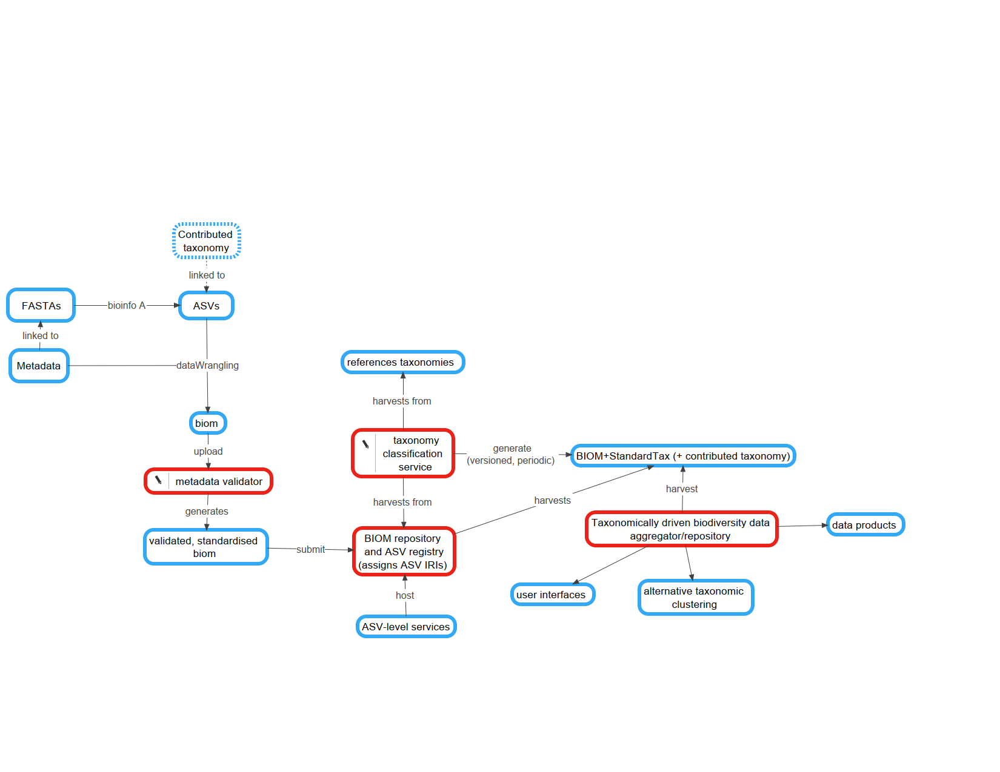

# The project

## Aim

To prototype a standardised flow of molecular biodiversity data into global biodiversity data infrastructures.

## About

In this repository, we'll be developing a common data exchange format for omic contingency tables and their metadata using the BIOM format. 

While BIOM may be used for many forms of data (genes, transcripts, traits, etc), we'll first be creating BIOM files based on Amplicon Sequence Variants of taxonomic marker genes. We'll be mergiing in MIxS compliant metadata and experimenting with the new Minimal Information about any (x) Observatory (MIxO) standard. Further, we'll be merging in both custom and standardised taxonomies to these files.

Simultaneously, our partners at the UNESCO Ocean Biogeographic Information System (OBIS) will be working to ingest these data products into their systems. 

## How to participate

If you have developed or want to develop a FASTQ to ASV processing flow and/or BIOM assembly method, please post an issue in this repository and we'll work with you to create a pull request. Please create a directory with your institute's acronym or name. 

You're then welcome to assist us in creating a common, central work flow for prototyping and Observatory to OBIS data flow.

# Contact

The best way to engage with this project is via its [Issue tracker](https://github.com/GLOMICON/asvBiomXchange/issues). 
Alternatively, please join and use the [GLOMICON mailing list](https://groups.google.com/forum/#!forum/glomicon).
